# MuJoCo Gymnasium Environments Solved

All 11 classic Gymnasium MuJoCo continuous-control environments trained to their target thresholds with **PPO**:

- **7 GPU environments** — Brax/MJX GPU physics with 2048 parallel environments: Ant, Humanoid, HumanoidStandup, InvertedPendulum, InvertedDoublePendulum, Pusher, Reacher.
- **4 CPU environments** — official Gymnasium + Stable-Baselines3 (used where Brax physics differs from official MuJoCo): HalfCheetah, Hopper, Swimmer, Walker2d.

## Results

| Environment | Engine | Result | Best rollout |
|---|---|---|---|
| Ant-v5 | brax-mjx | return **4337.0** · survival 0.879 · 4.18 m/s | 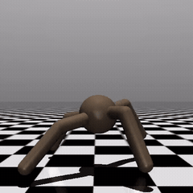<br>[open video](ant/deliverables/best_rollout.mp4) |
| HalfCheetah-v5 | gymnasium-sb3 | return **5811.8** · 6.13 m/s | 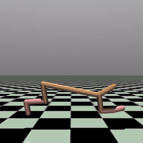<br>[open video](half_cheetah/deliverables/best_rollout.mp4) |
| Hopper-v5 | gymnasium-sb3 | return **3624.9** · survival 0.995 · 2.64 m/s | 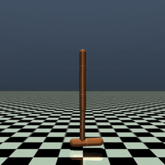<br>[open video](hopper/deliverables/best_rollout.mp4) |
| Humanoid-v5 | brax-mjx | return **10672.8** · survival 0.996 · 4.68 m/s | 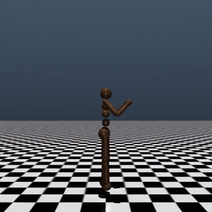<br>[open video](humanoid/deliverables/best_rollout.mp4) |
| HumanoidStandup-v5 | brax-mjx | return **76539.5** · upright 100% · final z 1.17 m | 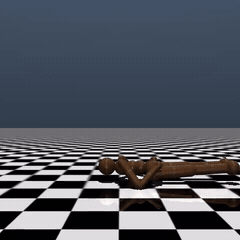<br>[open video](humanoid_standup/deliverables/best_rollout.mp4) |
| InvertedDoublePendulum-v5 | brax-mjx | return **9311.3** · survival 0.995 | 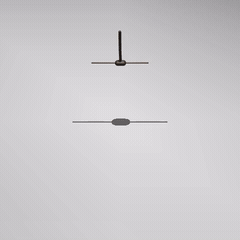<br>[open video](inverted_double_pendulum/deliverables/best_rollout.mp4) |
| InvertedPendulum-v5 | brax-mjx | return **1000.0** (perfect score) | 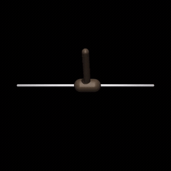<br>[open video](inverted_pendulum/deliverables/best_rollout.mp4) |
| Pusher-v5 | brax-mjx | goal distance **0.051 m** | 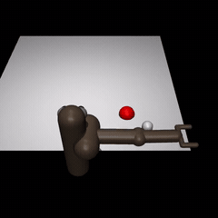<br>[open video](pusher/deliverables/best_rollout.mp4) |
| Reacher-v5 | brax-mjx | fingertip-to-goal **0.009 m** | 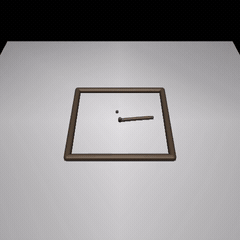<br>[open video](reacher/deliverables/best_rollout.mp4) |
| Swimmer-v5 | gymnasium-sb3 | return **358.8** (99.7% of official 360) | 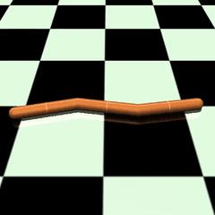<br>[open video](swimmer/deliverables/best_rollout.mp4) |
| Walker2d-v5 | gymnasium-sb3 | return **6100.9** · survival 1.0 · 5.10 m/s | 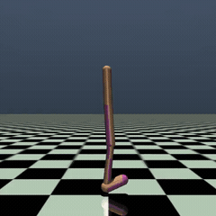<br>[open video](walker2d/deliverables/best_rollout.mp4) |

## Repository layout

```
_framework/           training and evaluation code
<env>/evaluate.ipynb  load the trained model, re-evaluate and render
<env>/deliverables/   config.yaml, final eval summary, trained model, rollout video
```

## Run a trained model

```bash
pip install -r requirements.txt
cd humanoid_standup
jupyter notebook evaluate.ipynb      # Run All
```

## Train from scratch

```bash
cd <env>                                   # e.g. humanoid_standup
python ../_framework/train_brax.py --config deliverables/config.yaml   # Brax/MJX envs
python ../_framework/train.py --config deliverables/config.yaml        # Gymnasium+SB3 envs
```

Brax/MJX training targets a GPU JAX backend; SB3 configs run on CPU.

## License

[MIT](LICENSE)
